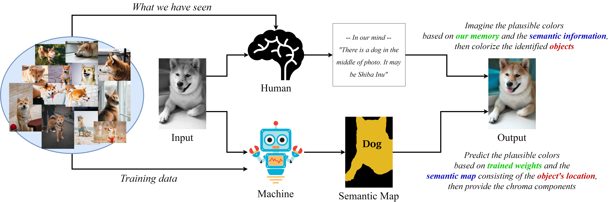

# Semantic-driven Colorization

#### [[Page]](https://minhmanho.github.io/semantic-driven_colorization/) [[Low-quality Paper]](https://arxiv.org/pdf/2006.07587.pdf) [[Demo]](https://drive.google.com/file/d/1SgGorxoZHxawSsP7II23Y5ENjLXXrMIm/view)


[Semantic-driven Colorization](https://arxiv.org/abs/2006.07587) <br>
[Man M. Ho](https://minhmanho.github.io/), Lu Zhang, Alexander Raake, [Jinjia Zhou](https://www.zhou-lab.info/jinjia-zhou)<br>
In ArXiv, 2020.
<br>

"_This work was completed (mostly) in early 2019 when I just started diving into deep learning. At that time, I was really curious about the correlation between deep neural networks and how we think._"

##  Abstract


<div align="right" style="font-size:11px"> (Source:  <a href="https://unsplash.com/">Unsplash</a> and <a href="https://commons.wikimedia.org/wiki/File:Robot-clip-art-book-covers-feJCV3-clipart.png">Wiki Common</a>) </div>
<br>

"*Recent colorization works implicitly predict the semantic information while learning to colorize black-and-white images. Consequently, the generated color is easier to be overflowed; plus, the semantic faults are invisible. As human experiences in colorization, our brains first detect and recognize the objects in the photo, then imagine their plausible colors based on many similar objects we have seen in real life, and finally colorize them. In this study, we simulate that human-like action to let our network first learn to understand the photo, then colorize it. By doing so, our network can provide plausible colors for specific objects under semantic constraint. Furthermore, the semantic information becomes understandable and interactable to the user.*"

## Prerequisites

- Ubuntu 16.04 (Windows OS with Anaconda is also okay)
- Python = 3.7
- OpenCV
- [PyTorch](https://pytorch.org/) = 1.1.0
- Numpy
- Qt = 5.9.7
- Qdarkstyle = 2.8
- gdown (for fetching models)

## Get Started

### 1. Clone this repo

```
git clone https://github.com/minhmanho/semantic-driven_colorization.git
cd semantic-driven_colorization
```

### 2. Fetch the pre-trained model

You can download the pre-trained colorization model at [Google Drive](https://drive.google.com/file/d/1uBQ1AkfD26Dib4B5bI0BHGoNGlNp8iPk/view?usp=sharing) (148MB) and semantic segmentation model at [Google Drive](https://drive.google.com/file/d/1J9Xdc9gZPAEAy0QhW1Umv-rbmutWKoTC/view?usp=sharing) (52MB), or run the following script:

```
./models/fetch_model.sh
```

## Run Colorization with Interactive Segmentation

Run our interactive colorization as:

```
CUDA_VISIBLE_DEVICES=0 python run.py \
    --imgs ./data/imgs/ \
    --out ./data/out/ \
    --color_ckpt ./models/color_weights.pth.tar \
    --seg_ckpt ./models/seg_weights.pth.tar \
    --labels ./data/labels-59.txt \
    --cuda
```

Tips:


## Results
### 1. Colorized Photos

### 2. A Semantic Fault


Perhaps our colorization model is trained mostly on the label "person" with a closed mouth. Therefore, there is a red color, which should have been for lips, on her teeth. To solve this, we tend to change the semantic information where implausible colors occur, as shown in the Figure.

## Citation

```
@misc{ho2020semanticdriven,
      title={Semantic-driven Colorization}, 
      author={Man M. Ho and Lu Zhang and Alexander Raake and Jinjia Zhou},
      year={2020},
      eprint={2006.07587},
      archivePrefix={arXiv},
      primaryClass={cs.CV}
}
```

## Acknowledgements

We refer these repositories to code our application
+ [Interactive Deep Colorization](https://github.com/junyanz/interactive-deep-colorization)
+ [GridNet](https://github.com/Hv0nnus/GridNet)

## License

This work is for **non-commercial** uses and research purposes only.

## Contact

If you have any questions, feel free to contact me (maintainer) at [manminhho.cs@gmail.com](mailto:manminhho.cs@gmail.com)
